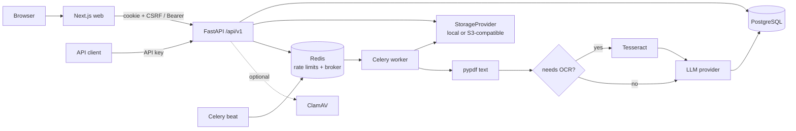

<div align="center">

# DocMind AI

**Secure, multi-tenant document intelligence: upload PDFs, extract structured data with an LLM, review it, export it.**

[](https://github.com/Santidelacarrera/DOCMIND_AI/actions/workflows/ci.yml)
[](https://github.com/Santidelacarrera/DOCMIND_AI/actions/workflows/codeql.yml)
[](LICENSE)
[](https://www.python.org/)
[](https://fastapi.tiangolo.com/)
[](https://nextjs.org/)
[](https://www.postgresql.org/)
[](https://redis.io/)

[Quick start](#quick-start) · [Architecture](#architecture) · [Security](#security) · [API](#api) · [Configuration](#configuration) · [Testing](#testing) · [Deployment](#deployment) · [Roadmap](#roadmap)

</div>

---

## Table of contents

1. [What it does](#what-it-does)
2. [Quick start](#quick-start)
3. [Architecture](#architecture)
4. [Processing pipeline](#processing-pipeline)
5. [Security](#security)
6. [API](#api)
7. [Configuration](#configuration)
8. [Development](#development)
9. [Testing](#testing)
10. [Deployment](#deployment)
11. [Operations](#operations)
12. [Design decisions](#design-decisions)
13. [Troubleshooting](#troubleshooting)
14. [Roadmap](#roadmap)
15. [Contributing and license](#contributing-and-license)

## What it does

DocMind AI turns PDFs (invoices, contracts, forms…) into reviewable, exportable data.

- **Multi-tenant by construction** — organizations, roles (owner/admin/member/viewer), projects, scoped API keys, usage quotas and audit logs.
- **Safe ingestion** — magic-byte, size, page-count and parse validation, optional ClamAV scanning, checksum de-duplication, opaque storage keys.
- **Asynchronous pipeline** — Celery workers with idempotent jobs, retries, time limits and automatic stuck-job recovery.
- **Text first, OCR when needed** — `pypdf` extraction with Tesseract fallback for scans.
- **Pluggable LLMs** — deterministic mock for development/tests, OpenAI Responses API with structured output for real extraction.
- **Your schema, your fields** — define JSON Schemas per organization or project, with full version history; pick a specific schema (and its version) right at upload time, or let the newest active one drive extraction.
- **Visible progress** — live processing status, failure reporting and one-click retry.
- **Human in the loop** — edit values in the browser, side by side with the original PDF; edits are flagged as manually verified.
- **Confidence-scored, validated extractions** — every field carries a 0–1 confidence score; a JSON Schema + confidence-threshold validation pass runs before a result is considered final and flags anything that needs review.
- **Exports** — JSON, CSV and XLSX, hardened against spreadsheet formula injection, carrying the model value, the corrected value and the correction reason.
- **Measured quality** — a reference corpus and `python -m app.evaluation` report precision/recall per field, OCR error, calibration and what the review gate catches ([docs/EVALUATION.md](docs/EVALUATION.md)).
- **Recoverable jobs** — durable job state, atomic claims, bounded retries, stuck-job and lost-message recovery, no duplicate results ([docs/RELIABILITY.md](docs/RELIABILITY.md)).
- **Retention** — deletion removes files and text immediately and purges derived data on a schedule ([docs/DATA_RETENTION.md](docs/DATA_RETENTION.md)).
- **Team collaboration** — email invitations to add people to a workspace, and webhooks that notify your own systems when a document finishes processing.
- **Production observability** — structured JSON logs, Prometheus metrics (`/metrics`) and OpenTelemetry traces out of the box.

## Quick start

Requirements: Docker Engine with Compose v2.

```bash
git clone https://github.com/Santidelacarrera/DOCMIND_AI.git
cd DOCMIND_AI
cp .env.example .env          # safe local defaults, mock LLM, local storage
docker compose up --build     # applies migrations automatically
```

| Service | URL |
|---|---|
| Web app | <http://localhost:3000> |
| API + interactive docs (development only) | <http://localhost:8000/docs> |
| Liveness / readiness | <http://localhost:8000/health> · <http://localhost:8000/ready> |

1. Open the web app, **create an account** (password ≥ 12 characters).
2. In **Documents**, create a project and upload a PDF.
3. The worker processes it; open the document to review, edit and export the result.

> The default `.env.example` uses `LLM_PROVIDER=mock`, which returns a fixed fixture so the whole flow works offline. Set `LLM_PROVIDER=openai` and `OPENAI_API_KEY` for real extraction.

## Architecture



| Component | Responsibility |
|---|---|
| **web** (`frontend/`) | Next.js 16 / React 19 UI: auth, projects, upload, review, schemas. Strict CSP. |
| **api** (`backend/app/main.py`) | The *only* authorization boundary: authentication, tenancy, validation, quotas, exports. |
| **worker** (`backend/app/worker.py`) | Idempotent document processing with row-level job locks, retries and timeouts. |
| **scheduler** | Celery beat; runs `recover_stuck_jobs` every minute. Run exactly one. |
| **PostgreSQL** | System of record, schema owned by Alembic. |
| **Redis** | Celery broker/result backend and fixed-window rate limiter (fails closed). |
| **Storage** | `StorageProvider` abstraction shared by API and worker. |

```text
.
├── backend/
│   ├── app/            # FastAPI app, models, security, worker, providers
│   ├── alembic/        # database migrations
│   └── tests/          # hermetic API + worker tests, opt-in Docker integration
├── frontend/
│   ├── app/            # Next.js routes
│   ├── components/     # shared UI
│   ├── lib/            # browser API client (CSRF aware)
│   └── tests/e2e/      # Playwright, against the real stack
├── docs/               # API, architecture, security, operations, staging, ADRs
├── docker-compose.yml          # development stack
├── docker-compose.prod.yml     # hardened overlay
└── .github/                    # CI, CodeQL, Dependabot, PR template
```

## Processing pipeline

1. **Upload** — authenticate, authorize (`member`+ or `documents:write`), validate (extension, `%PDF-` magic bytes, declared and actual size, parsable, page limit), optional antivirus, quota check under a row lock, de-duplicate by SHA-256, store under `{org}/{uuid}.pdf`, create document, version, usage reservation and job.
2. **Claim** — the worker locks the job row (`SELECT … FOR UPDATE`); completed jobs are no-ops, so at-least-once delivery is safe.
3. **Extract text** — `pypdf`; if text density is below the threshold, Tesseract OCR runs (bounded pages and time).
4. **LLM** — the schema version pinned at upload/reprocess time (or, failing that, the newest active schema for the project/organization) is wrapped in a `{"fields": …, "confidence": …}` envelope. OpenAI *strict* structured output is requested only when the schema is strict-compatible. Document text is sent as untrusted data.
5. **Validate** — the extracted fields are checked against the schema and against the per-field confidence threshold; any issue marks the run `requires_review`.
6. **Persist** — pages, steps, extraction run (schema version, confidence scores, validation issues) and usage records are committed atomically with the `COMPLETED` status. Failures store a stable code, never raw provider errors.
7. **Notify** — active webhooks subscribed to `document.completed`/`document.failed` get a signed POST.
8. **Review & export** — edit fields, then export JSON / CSV / XLSX.

## Security

Security is the primary design constraint. Highlights (details in [SECURITY.md](SECURITY.md), [docs/SECURITY.md](docs/SECURITY.md) and the [threat model](docs/security/threat-model.md)):

**Identity and sessions**
- Argon2id password hashing and a basic weak-password filter; login does constant work for unknown users (no timing oracle) and is rate-limited per IP **and** per account.
- JWTs require `exp`, `sub` and a session version; malformed or forged tokens return `401`, never `500`. Logout bumps the version, revoking all tokens.
- Cookie sessions are `HttpOnly`, `Secure` outside development, `SameSite`, with double-submit CSRF on **every** state-changing request (including logout).
- API keys (`dm_live_…`) are random 256-bit secrets, shown once, stored as SHA-256, revocable, bound to one organization and an allow-list of scopes. They can never reach user-only endpoints (`/auth/*`, organizations, key management, audit logs).

**Tenancy**
- Every query is filtered by an organization id that is checked against membership server-side; cross-tenant ids return `403`/`404` (covered by tests for every resource).
- Worker schema lookup is organization-scoped, so a tenant can never receive another tenant's schema.

**Input and output**
- Bounded everything: streamed request bodies (chunked uploads cannot bypass the limit), file size, pages, strings, scopes, JSON field values, schema size.
- Filenames are sanitized on ingest; `Content-Disposition` is RFC 6266 encoded (no header injection).
- CSV/XLSX exports neutralize `= + - @` formula prefixes (CSV injection).
- Responses carry `nosniff`, `Referrer-Policy`, `Permissions-Policy`, `Cache-Control: no-store`, CSP and `frame-ancestors`; HSTS when cookies are secure. The PDF viewer may only be framed by the configured web origins. OpenAPI/Swagger are disabled in staging/production.
- CORS allow-list with explicit methods/headers; production requires HTTPS origins.

**Fail-safe configuration**
- With `ENVIRONMENT=staging|production` the API refuses to start unless a ≥32-char `JWT_SECRET`, secure cookies, HTTPS CORS origins, private object storage, an antivirus provider and database/Redis URLs are configured.
- Containers run as a non-root user; the production overlay adds read-only filesystems, dropped capabilities, `no-new-privileges`, resource limits, a password-protected Redis and an internal-only data network (the API and worker keep egress for object storage and the LLM).

**Pipeline**
- Quotas are enforced under an organization row lock to prevent concurrent over-spend.
- LLM prompts keep document text separate from instructions; input, output, timeout and concurrency are bounded.
- Supply chain: Dependabot, CodeQL, `bandit`, `pip-audit`, `npm audit`, lockfile installs.

To report a vulnerability, follow [SECURITY.md](SECURITY.md).

## API

Base path `/api/v1`. Authenticate with a session cookie (+ `X-CSRF-Token`), `Authorization: Bearer <JWT>`, or `Authorization: Bearer <api key>`.

| Area | Endpoints |
|---|---|
| Auth | `POST /auth/register` · `POST /auth/login` · `POST /auth/logout` · `GET /auth/me` |
| Organizations | `GET, POST /organizations` · `GET, POST /members` · `PATCH, DELETE /members/{user_id}` |
| Projects | `GET, POST /projects` |
| Documents | `POST, GET /documents` · `GET, DELETE /documents/{id}` · `POST /documents/{id}/process` · `GET /documents/{id}/status` · `GET /documents/{id}/download[?inline=true]` |
| Extraction | `GET /documents/{id}/extraction` · `PATCH /extraction-fields/{id}` · `GET /documents/{id}/export?format=json\|csv\|xlsx` |
| Schemas | `GET, POST /schemas` |
| API keys | `GET, POST /api-keys` · `DELETE /api-keys/{id}` |
| Ops | `GET /usage` · `GET /audit-logs` · `GET /health` · `GET /ready` |

API-key scopes: `documents:read`, `documents:write`, `schemas:read`, `exports:read`, `usage:read`.

```bash
# register, create a project, upload, fetch the result
TOKEN=$(curl -s localhost:8000/api/v1/auth/register -H 'content-type: application/json' \
  -d '{"email":"me@example.com","password":"correct-horse-battery","organization_name":"Acme"}')
# ... see docs/API.md for the complete walkthrough
```

Full reference: [docs/API.md](docs/API.md) (and `/docs` in development).

## Configuration

All settings are environment variables (see [.env.example](.env.example)).

| Group | Variables |
|---|---|
| Application | `ENVIRONMENT`, `MAX_UPLOAD_BYTES`, `MAX_PDF_PAGES`, `MAX_PDF_TEXT_CHARS`, `PROCESSING_TIMEOUT_SECONDS`, `STUCK_JOB_SECONDS`, `QUEUED_STUCK_SECONDS`, `MAX_JOB_RECOVERIES`, `FREE_PAGES_PER_MONTH` |
| Quality / review | `CONFIDENCE_REVIEW_THRESHOLD`, `OCR_REVIEW_THRESHOLD`, `SCHEMA_VIOLATION_POLICY` (`review`\|`reject`), `LLM_INVALID_OUTPUT_RETRIES`, `OPENAI_INPUT_PRICE_PER_1M`, `OPENAI_OUTPUT_PRICE_PER_1M` |
| Retention | `RETENTION_DELETED_DAYS`, `RETENTION_DOCUMENT_DAYS` (see [docs/DATA_RETENTION.md](docs/DATA_RETENTION.md)) |
| Data | `DATABASE_URL`, `REDIS_URL`, `POSTGRES_*` |
| Storage | `STORAGE_PROVIDER` (`local`\|`s3`), `LOCAL_STORAGE_PATH`, `S3_BUCKET`, `S3_ENDPOINT_URL`, `S3_REGION`, `S3_KMS_KEY_ID`, `AWS_*` |
| LLM / OCR | `LLM_PROVIDER` (`mock`\|`openai`), `OPENAI_*`, `MAX_OCR_PAGES`, `OCR_TIMEOUT_SECONDS` |
| Security | `JWT_SECRET`, `JWT_ALGORITHM`, `ACCESS_TOKEN_MINUTES`, `COOKIE_SECURE`, `COOKIE_SAMESITE`, `CSRF_ENABLED`, `CORS_ORIGINS`, `RATE_LIMIT_*`, `ANTIVIRUS_PROVIDER`, `CLAMAV_*` |
| Email (invitations) | `SMTP_HOST`, `SMTP_PORT`, `SMTP_USERNAME`, `SMTP_PASSWORD`, `SMTP_USE_TLS`, `SMTP_FROM`, `INVITATION_EXPIRY_HOURS`, `FRONTEND_BASE_URL` |
| Observability | `LOG_LEVEL`, `LOG_FORMAT`, `OTEL_SERVICE_NAME`, `OTEL_EXPORTER_OTLP_ENDPOINT` (see [docs/OBSERVABILITY.md](docs/OBSERVABILITY.md)) |
| Web | `NEXT_PUBLIC_API_URL` (build-time, public, never a secret) |

## Development

```bash
docker compose up --build        # full stack with reload

# backend, without Docker (needs no services for the test-suite)
cd backend
pip install -e '.[dev]'
ruff check . && mypy app && pytest --cov=app

# frontend
cd frontend
npm ci
npm run dev
```

Create migrations with `docker compose exec api alembic revision --autogenerate -m "…"` and review them before committing. More in [docs/DEVELOPMENT.md](docs/DEVELOPMENT.md) and [CONTRIBUTING.md](CONTRIBUTING.md).

## Testing

| Layer | Command | Notes |
|---|---|---|
| Static analysis | `ruff check .` · `mypy app` · `bandit -r app -ll` | Strict typing, security lint |
| Backend unit/API | `pytest --cov=app` | Hermetic by default: SQLite, in-memory Redis double. Covers auth, tenancy, uploads, exports, worker pipeline. Add `TEST_DATABASE_URL=postgresql+psycopg://…` to run it on PostgreSQL |
| Job queue | `pytest tests/test_celery_redis.py` | A real `redis-server` + Celery worker: completion, duplicate messages, retries, lost-message recovery (skipped without `redis-server`). See [docs/RELIABILITY.md](docs/RELIABILITY.md) |
| Quality evaluation | `python -m app.evaluation` | Field precision/recall/F1, OCR error rates, confidence calibration, review routing, rejections and a simulated review/export pass over a 19-document reference corpus; also a pytest regression gate. See [docs/EVALUATION.md](docs/EVALUATION.md) |
| Tenant isolation / injection | `pytest tests/test_tenant_isolation.py tests/test_prompt_injection.py` | Route-table-driven negative tests across API and storage; hostile document content |
| Docker integration | `DOCMIND_INTEGRATION=1 pytest tests/test_docker_integration.py` | Real Postgres, Redis and worker |
| Frontend | `npm run lint` · `npm run typecheck` · `npm run build` | |
| Browser E2E | `npm run test:e2e` | Playwright against the real stack (`E2E_BASE_URL`, `E2E_API_URL`) |

CI runs all of the above plus CodeQL, dependency audits and Compose validation on every pull request.

## Deployment

`docker-compose.prod.yml` is a hardened overlay (non-reload workers, read-only filesystems, healthchecks, resource limits, internal networks):

```bash
export REDIS_PASSWORD=...   # required by the overlay; REDIS_URL must use the same password
docker compose -f docker-compose.yml -f docker-compose.prod.yml build
docker compose -f docker-compose.yml -f docker-compose.prod.yml run --rm api alembic upgrade head   # release step
docker compose -f docker-compose.yml -f docker-compose.prod.yml up -d
```

Before going live, provide (see [docs/STAGING.md](docs/STAGING.md) and [docs/DEPLOYMENT.md](docs/DEPLOYMENT.md)):

- TLS termination and a reverse proxy that sets `X-Forwarded-*` (run uvicorn with `--proxy-headers --forwarded-allow-ips=<proxy>` so rate limiting sees real client addresses),
- managed PostgreSQL and Redis (TLS, auth, persistence, backups),
- private S3-compatible storage with encryption and lifecycle rules,
- a ClamAV service, secrets from a secret manager, and the web and API on the same registrable domain so `SameSite` cookies work.

## Operations

- **Health** `GET /health` (liveness) · `GET /ready` (database).
- **Stuck jobs** — beat runs `recover_stuck_jobs` every 60 s: in-flight jobs older than `STUCK_JOB_SECONDS` and queued jobs older than `QUEUED_STUCK_SECONDS` are re-enqueued (up to `MAX_JOB_RECOVERIES` times), then marked `FAILED/PROCESSING_TIMEOUT`; list them with `GET /documents?status=FAILED` and re-run via `POST /documents/{id}/process`. Details: [docs/RELIABILITY.md](docs/RELIABILITY.md).
- **Audit** — `GET /audit-logs` (admin) records auth, uploads, processing, edits and key lifecycle, including the API key used.
- **Monitoring and retention** — see [docs/OPERATIONS.md](docs/OPERATIONS.md).

## Design decisions

| Decision | Rationale |
|---|---|
| API is the single authorization boundary | One place to audit tenancy; the web app is untrusted |
| Fail-closed rate limiting | A broken Redis must not silently disable brute-force protection |
| Row locks for quotas and job claiming | Correctness under concurrency without distributed locks |
| Storage and LLM behind interfaces | Swap local/S3 and mock/OpenAI without touching business logic |
| Stable failure codes, no raw errors | Provider and parser errors can leak data |
| Strict mode only when the schema allows it | User schemas should not turn into opaque provider errors |

See [docs/decisions/](docs/decisions/) for ADRs.

## Troubleshooting

| Symptom | Check |
|---|---|
| `/ready` fails | Database connectivity and `alembic upgrade head` |
| `503 RATE_LIMIT_UNAVAILABLE` | Redis reachable at `REDIS_URL` (limiter fails closed) |
| Job stays `QUEUED` | Worker running and connected to the same Redis |
| PDF viewer is blank | `CORS_ORIGINS` must contain the exact web origin (it also drives `frame-ancestors`) |
| Browser calls the wrong API | `NEXT_PUBLIC_API_URL` is baked at build time; rebuild the web image |
| `403 CSRF_FAILED` | Send `X-CSRF-Token` equal to the `csrf_token` cookie, or use a Bearer token |
| API refuses to start in staging | Read the validation message; see [docs/STAGING.md](docs/STAGING.md) |

## Roadmap

- Multiple reviewers per document with assignment (today: per-field correction with a reason, one approval per run)
- An LLM accuracy baseline on a held-out set of real, consented documents (the shipped corpus is synthetic)
- Configurable webhook retry/backoff policy and a delivery-log UI
- Self-serve Grafana dashboard provisioning for the bundled metrics

## Contributing and license

Contributions are welcome — see [CONTRIBUTING.md](CONTRIBUTING.md). Released under the [MIT License](LICENSE).
