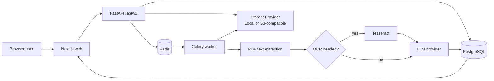

# DocMind AI

[](https://www.python.org/)
[](https://fastapi.tiangolo.com/)
[](https://nextjs.org/)
[](https://www.postgresql.org/)
[](https://redis.io/)
[](https://www.docker.com/)

DocMind AI is a multi-tenant document-processing application. It accepts PDF uploads, processes them asynchronously, extracts structured fields through a configurable LLM provider, supports review/editing, and exports results as JSON, CSV, or XLSX.

The repository includes a local Docker stack and a production-oriented Compose overlay. External infrastructure and credentials are intentionally not included.

## Overview

FastAPI is the authorization boundary for organizations, projects, documents, extraction data, and exports. PDFs are stored through a provider abstraction; a Celery worker then extracts text, optionally runs OCR, invokes the selected LLM provider, and persists results in PostgreSQL.



## Core capabilities

- Organization-scoped users, projects, documents, schemas, API keys, usage, and audit logs.
- Role-based membership and API-key scope checks.
- PDF signature, size and page validation; checksum duplicate detection; quotas; opaque storage keys.
- Asynchronous processing with idempotent jobs, bounded retries, task time limits, and a stuck-job recovery task.
- PDF text extraction through `pypdf` and conditional OCR with Poppler/pdf2image and Tesseract.
- Deterministic Mock LLM for local/testing and an optional OpenAI Responses API provider.
- Extraction review/editing plus JSON, CSV, and XLSX export.
- Playwright coverage for login, upload/processing, extraction editing/export, and tenant isolation.

## Processing pipeline

1. The API authenticates the caller, verifies organization/project access, validates the PDF, applies quota checks, and invokes the configured antivirus provider.
2. It stores the object under a generated opaque key and creates the document, version, usage reservation, and queued job.
3. Celery locks the job, reads storage, extracts text, and uses OCR when text density requires it.
4. Page text, processing steps, LLM result, extraction fields, and usage records are persisted before the job is marked `COMPLETED`.

The worker currently uses a generic structured-output schema. Schema creation/versioning endpoints exist, but selecting a tenant schema for a worker extraction is not currently wired into the processing path. There is no separate document segmentation or business-rule validation stage.

## Technology stack

| Area | Technologies |
|---|---|
| Frontend | Next.js 16, React 19, TypeScript, ESLint |
| Backend | Python 3.12, FastAPI, Pydantic Settings, SQLAlchemy |
| Database | PostgreSQL 17, Alembic, psycopg |
| Background jobs | Celery 5, Redis 7 |
| AI / LLM | Mock provider; optional OpenAI Responses API provider |
| PDF / OCR | pypdf, pdf2image/Poppler, Tesseract, pytesseract |
| Storage | Local volume provider; S3-compatible provider through boto3 |
| Testing | pytest, Playwright, TypeScript typecheck, ESLint |
| Infrastructure | Docker and Docker Compose |

## Repository structure

```text
.
├── backend/
│   ├── app/                 # FastAPI, models, worker and providers
│   ├── alembic/             # Database migrations
│   ├── tests/               # Health, settings and Docker integration tests
│   ├── Dockerfile
│   └── pyproject.toml
├── frontend/
│   ├── app/                 # Next.js pages
│   ├── lib/                 # Browser API client
│   ├── tests/e2e/           # Playwright tests
│   ├── Dockerfile
│   └── package.json
├── docs/
├── docker-compose.yml       # Development stack
├── docker-compose.prod.yml  # Production-oriented overlay
├── .env.example
└── README.md
```

## Requirements

The Docker workflow requires Docker Engine and Docker Compose v2. Direct development additionally requires Python 3.12+, Node.js compatible with the checked-in frontend dependencies, PostgreSQL, Redis, Tesseract, and Poppler.

## Configuration

Copy `.env.example` to `.env` and populate it through a local secret mechanism. Do not commit `.env` files.

```bash
cp .env.example .env
```

| Group | Variables |
|---|---|
| Application | `ENVIRONMENT`, `MAX_UPLOAD_BYTES`, `MAX_PDF_PAGES`, `PROCESSING_TIMEOUT_SECONDS`, `STUCK_JOB_SECONDS` |
| Database | `DATABASE_URL`; local Compose uses `POSTGRES_DB`, `POSTGRES_USER`, `POSTGRES_PASSWORD` |
| Redis | `REDIS_URL` |
| Storage | `STORAGE_PROVIDER`, `LOCAL_STORAGE_PATH`, `S3_BUCKET`, `S3_ENDPOINT_URL`, `S3_REGION`, `AWS_ACCESS_KEY_ID`, `AWS_SECRET_ACCESS_KEY`, optional `AWS_SESSION_TOKEN` |
| LLM | `LLM_PROVIDER`, `OPENAI_API_KEY`, `OPENAI_MODEL`, `OPENAI_TIMEOUT_SECONDS`, `OPENAI_MAX_RETRIES`, `OPENAI_MAX_*` |
| Security | `JWT_SECRET`, `JWT_ALGORITHM`, `ACCESS_TOKEN_MINUTES`, `COOKIE_SECURE`, `COOKIE_SAMESITE`, `CSRF_ENABLED`, `RATE_LIMIT_*` |
| Browser/API | `CORS_ORIGINS`, `NEXT_PUBLIC_API_URL` |
| OCR / antivirus | `MAX_OCR_PAGES`, `OCR_TIMEOUT_SECONDS`, `ANTIVIRUS_PROVIDER`, `CLAMAV_HOST`, `CLAMAV_PORT` |

`NEXT_PUBLIC_API_URL` is bundled into the browser application and must never contain a secret. The complete staging matrix is in [docs/STAGING.md](docs/STAGING.md).

## Local development

From the repository root:

```bash
docker compose up --build
```

| Service | Address |
|---|---|
| Web | http://localhost:3000 |
| API / OpenAPI | http://localhost:8000/docs |
| Health | http://localhost:8000/health |
| Readiness | http://localhost:8000/ready |

The development Compose file mounts `./backend` and runs Uvicorn with reload. It is not the production configuration.

## Database and migrations

Alembic owns the database schema. Apply and inspect migrations with:

```bash
docker compose exec api alembic upgrade head
docker compose exec api alembic current
```

Migration sources are in `backend/alembic/versions/`.

## Background workers

The API queues work in Celery; Redis is the broker and result backend. The worker enables late acknowledgements, rejects lost-worker tasks, uses one-task prefetch, task time limits, and bounded retries for retryable I/O errors.

`app.worker.recover_stuck_jobs` can mark work that exceeds the configured SLA as failed. It must be scheduled externally (for example by Celery Beat or the deployment platform); this repository does not configure a Beat service.

## AI and LLM architecture

`LLM_PROVIDER=mock` selects the deterministic Mock LLM used by local and browser integration flows and makes no external request.

`LLM_PROVIDER=openai` selects the OpenAI provider and requires `OPENAI_API_KEY`. It has explicit timeout, SDK retry, bounded input/output, process-local concurrency, and structured JSON output. Document text is treated as untrusted data and is kept separate from extraction instructions.

## Storage architecture

`StorageProvider` is used by both API and worker:

- `local` writes opaque keys under `LOCAL_STORAGE_PATH`; it is intended for local development.
- `s3` uses boto3 against an S3-compatible endpoint, including Supabase Storage when configured with its S3-compatible endpoint and runtime credentials.

The API attempts to delete a newly written object if its subsequent database transaction fails. Staging/production validation rejects local storage. API and worker must receive identical `STORAGE_PROVIDER`, `S3_*`, and `AWS_*` configuration; see [the split-configuration note](docs/STAGING.md#avoiding-split-configuration).

## Authentication and authorization

- Passwords use `pwdlib` with the recommended Argon2 configuration.
- Access tokens are signed JWTs with expiration, token ID, and user session version.
- Logout increments session version and invalidates earlier JWTs for that user.
- Browser cookies are HttpOnly; secure cookies are required outside development. Cookie-authenticated writes use double-submit CSRF.
- Organizations support owner, admin, member, and viewer roles.
- API keys are issued once, stored as SHA-256 hashes, can be revoked/expired, and enforce organization/scope checks.
- Organization IDs supplied by clients do not grant access without server-side membership validation.

## API

The API prefix is `/api/v1`; interactive OpenAPI documentation is at `/docs`.

| Domain | Main routes |
|---|---|
| Health | `GET /health`, `GET /ready` |
| Authentication | `POST /auth/register`, `POST /auth/login`, `POST /auth/logout`, `GET /auth/me` |
| Organizations/projects | `GET, POST /organizations`; `GET, POST /projects` |
| Documents | `POST, GET /documents`; processing, status, download, extraction and export routes |
| Extraction | `PATCH /extraction-fields/{id}` |
| Schemas | `GET, POST /schemas` |
| API keys | `GET, POST /api-keys`; `DELETE /api-keys/{id}` |
| Operations | `GET /usage`, `GET /audit-logs` |

Organization-scoped routes require `organization_id` and authenticated authorization. See [docs/API.md](docs/API.md) and OpenAPI for request shapes.

## Testing

Run backend commands from `backend/`:

```bash
python -m compileall -q app
python -m pytest -q
ruff check .
```

Docker integration tests are opt-in and need the local stack:

```bash
DOCMIND_INTEGRATION=1 python -m pytest -q tests/test_docker_integration.py
```

Run frontend commands from `frontend/`:

```bash
npm run typecheck
npm run lint
npm run build
npm run test:e2e
```

The Playwright suite runs against the local API/web stack and does not mock browser API requests.

## Security

Implemented controls include upload signature/size/page checks, configurable antivirus scanning, opaque storage keys, server-side tenant authorization, Redis-backed rate limiting, password hashing, JWT session invalidation, CSRF protection for cookie sessions, API-key hashing/revocation, and audit logs.

Staging/production validation rejects missing database, Redis, JWT, secure-cookie, HTTPS CORS, antivirus, S3, and conditional OpenAI configuration. TLS, managed PostgreSQL/Redis, object storage, secret management, centralized monitoring, backups, and restore procedures are external deployment requirements. See [docs/SECURITY.md](docs/SECURITY.md), [docs/STAGING.md](docs/STAGING.md), and [docs/OPERATIONS.md](docs/OPERATIONS.md).

## Staging and production

`docker-compose.prod.yml` overlays the development Compose file with non-reload API workers, read-only API/web filesystems, healthchecks, restart policies, resource limits, and internal networks. API, worker, and web containers run as `appuser`.

```bash
docker compose -f docker-compose.yml -f docker-compose.prod.yml build
```

The Compose files prepare a deployment; they do not replace managed infrastructure. Provision and inject required external services before declaring a staging environment operational.

## Observability and audit data

The data model records audit events, processing steps, job status/failure code, extraction runs, extraction fields, and usage records. These are application records, not centralized metrics or monitoring. Logs, metrics export, alerts, retention, backups, and restore verification remain deployment-platform responsibilities described in [docs/OPERATIONS.md](docs/OPERATIONS.md).

## Troubleshooting

| Symptom | Check |
|---|---|
| API readiness fails | Verify PostgreSQL connectivity, migration state, and required environment variables. |
| Authentication/upload returns `503` | Verify Redis; rate limiting fails closed when Redis is unavailable. |
| A job remains queued | Confirm the worker is running and can connect to Redis. |
| Processing fails | Inspect job failure code and worker logs; check storage, PDF validity, OCR, and LLM availability. |
| S3 object is missing | Confirm API and worker both use `STORAGE_PROVIDER=s3` with identical `S3_*` and `AWS_*` variables. |
| Migration errors | Run `alembic current` and `alembic upgrade head` against the intended database. |
| Docker startup fails | Validate `.env` for local development or inject the required staging secrets. |

## Development guidelines

- Put backend/domain/provider changes in `backend/app/`; add schema changes with Alembic migrations.
- Put browser pages in `frontend/app/` and shared browser API behavior in `frontend/lib/`.
- Update backend, integration, and browser tests with behavior changes.
- Update the relevant document under `docs/` when changing deployment, security, architecture, or operations.

## License

No license file is currently defined in this repository.
