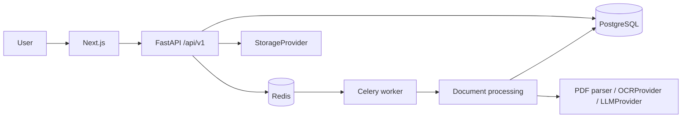

# Architecture

The API is the authorization boundary. Every organization-owned query receives an organization id derived from the authenticated principal; client-supplied organization ids never grant access. Workers reload the document version from the database and atomically claim jobs, making retries safe.
